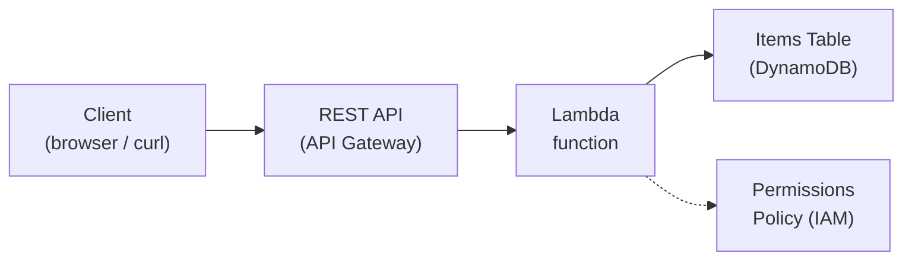

# Cloud Ta Bai Session 3: Flying Light

> **Serverless CRUD API Workshop** — Build a CRUD API with AWS Lambda, API Gateway, and DynamoDB.

## What You'll Build

By the end of this workshop, you'll have a fully working **REST API** that can **C**reate, **R**ead, **U**pdate, and **D**elete items — all running serverless on AWS (no servers to manage!).

> This workshop uses three AWS **services** (API Gateway, Lambda, DynamoDB) and the **resources** you'll create within them (a REST API, a function, and a table). The IAM Permissions Policy grants your Lambda function access to DynamoDB.

**The services:**
- **[API Gateway](https://aws.amazon.com/api-gateway/)** — the *front door* for your application. Receives HTTP requests and routes them to Lambda.
- **[Lambda](https://aws.amazon.com/lambda/)** — the *compute* service. Runs your JavaScript code on-demand without servers (you only pay when it runs).
- **[DynamoDB](https://aws.amazon.com/dynamodb/)** — the *database*. A fully managed NoSQL key/value data store that scales automatically.

## Prerequisites

- [ ] AWS Account ([sign up here](https://aws.amazon.com/free/) — free tier is enough)
- [ ] A modern web browser (Chrome, Firefox, Edge, etc.)
- [ ] (Optional) Terminal with `curl` for testing API endpoints

> **No local setup required!** All code runs in the AWS Console. You don't need Node.js, npm, or any IDE on your machine.

## Workshop Guide (Notion)

> **Follow the Notion guide during the workshop — this repo is for reference only.**
>
> The Notion page has the full step-by-step instructions, troubleshooting tips, and checkpoints.
> This repo contains the correct code for each session so you can compare your work or catch up if you fall behind.
>
> **[Open the Workshop Guide](https://cyvid7.notion.site/Cloud-Ta-Bai-Session-3-Flying-Light-209f1cdcedf680ac88b0da5f5ba70e23)**

## How to Use This Repo

This repo is a **reference companion** to the Notion workshop guide. Use it to:

- **Compare your work** — Check your code against the reference if something isn't working
- **Catch up** — Copy-paste the code if you fall behind during the workshop
- **Review later** — Come back after the workshop to study how each piece works

> **Tip:** Don't just copy-paste blindly! Try writing the code yourself first — you'll learn more that way. Use this repo to check your work or get unstuck.

## Workshop Sessions

| Session | What You'll Do | Code |
|---------|---------------|------|
| **1** | Create your first Lambda function (Hello World) | [`session-1/index.mjs`](./session-1/index.mjs) |
| **2** | Connect Lambda to the internet via API Gateway | [`session-2/README.md`](./session-2/README.md) (config steps, no code changes) |
| **3** | Add a DynamoDB database — save and list items | [`session-3/index.mjs`](./session-3/index.mjs) |
| **4** | Build the full CRUD API (Create, Read, Delete) | [`session-4/index.mjs`](./session-4/index.mjs) |
| **Challenge** | Add a PATCH endpoint to update item prices | [`challenge/index.mjs`](./challenge/index.mjs) |

## API Endpoints (Final)

Once you finish Session 4, your API will support these routes:

| Method | Path | Description | Example Body |
|--------|------|-------------|--------------|
| `GET` | `/items` | List all items | — |
| `GET` | `/items/{id}` | Get a single item by ID | — |
| `PUT` | `/items` | Create or replace an item | `{"id": "1", "name": "Laptop", "price": 999}` |
| `DELETE` | `/items/{id}` | Delete an item by ID | — |
| `PATCH` | `/items/{id}` | Update an item's price (challenge) | `{"price": 799}` |

## AWS Console Quick Links

Use these during the workshop (make sure your region is set to **ap-southeast-1 Singapore**):

| Service | Console Link |
|---------|-------------|
| Lambda | [console.aws.amazon.com/lambda](https://console.aws.amazon.com/lambda/) |
| API Gateway | [console.aws.amazon.com/apigateway](https://console.aws.amazon.com/apigateway/) |
| DynamoDB | [console.aws.amazon.com/dynamodb](https://console.aws.amazon.com/dynamodb/) |
| CloudWatch Logs | [console.aws.amazon.com/cloudwatch](https://console.aws.amazon.com/cloudwatch/) |
| IAM (Permissions) | [console.aws.amazon.com/iam](https://console.aws.amazon.com/iam/) |

## Key Concepts

> **Services vs Resources:** A *service* (e.g. Lambda) is the AWS platform you use. A *resource* (e.g. a Lambda *function*) is a specific thing you create within that service. When someone says "my Lambda," they usually mean their Lambda *function*.

**DynamoDB concepts:**
- **Item** — a single record in the table (like a row in SQL)
- **Attribute** — a data field on an item (like a column). Example: `name`, `price`
- **Partition key** — the primary key that uniquely identifies each item. Ours is `id` (String)

**Lambda concepts:**
- **Handler** — the function AWS calls when your Lambda is triggered: `export const handler = async (event, context) => { ... }`
- **`event`** — contains the request data (HTTP method, body, path parameters, query strings)
- **`context`** — contains runtime info (request ID, function name, memory limit, remaining time)
- **Cold start** — the first invocation takes longer because AWS must initialize the runtime. Subsequent calls to the same instance are "warm."

**Function Logs** (you'll see these in CloudWatch and the Lambda test console):
- **START** — the function was invoked. Shows the request ID and version (`$LATEST`).
- **END** — the function finished (success or error).
- **REPORT** — performance summary: Duration, Billed Duration, Memory Size, Max Memory Used, and Init Duration (cold start only).

## Key AWS Resources

These are the exact names used throughout the workshop — use them to follow along:

| Service | Resource You Create | Name |
|---------|-------------------|------|
| Lambda | Function | `hello-serverless` |
| DynamoDB | Table | `http-crud-tutorial-items` (partition key: `id`, String) |
| API Gateway | HTTP API | `hello-api` |
| IAM | Permissions Policy | `AmazonDynamoDBFullAccess` (attached to Lambda's role) |

| Setting | Value |
|---------|-------|
| Runtime | Node.js 20.x |
| Region | `ap-southeast-1` (Singapore) — closest to the Philippines |

## Clean-Up Instructions

**Important:** Delete these resources after the workshop to avoid unexpected charges.

Go to the AWS Console in the `ap-southeast-1` (Singapore) region and delete in this order:

1. **API Gateway** — API Gateway console → Select `hello-api` → Actions → Delete
2. **Lambda Function** — Lambda console → Select `hello-serverless` → Actions → Delete function
3. **DynamoDB Table** — DynamoDB console → Tables → Select `http-crud-tutorial-items` → Delete table
4. **CloudWatch Logs** — CloudWatch console → Log groups → Delete `/aws/lambda/hello-serverless`

## Best Practices Used in This Repo

The code in this repo follows [AWS Lambda best practices](https://docs.aws.amazon.com/lambda/latest/dg/best-practices.html) and aligns with the [official AWS CRUD HTTP API tutorial](https://docs.aws.amazon.com/apigateway/latest/developerguide/http-api-dynamo-db.html):

| Practice | What & Why |
|----------|-----------|
| **SDK clients outside handler** | `DynamoDBClient` is created once and reused across warm invocations — reduces cold start time |
| **Environment variable for config** | `process.env.TABLE_NAME` with fallback — avoids hardcoding, easy to change per environment |
| **`finally` block for serialization** | `JSON.stringify` always runs, even on error — matches the official AWS tutorial pattern |
| **Event logging** | `console.log("Event:", ...)` — essential for debugging via CloudWatch Logs |
| **Handler `context` parameter** | Standard `(event, context)` signature — gives access to request ID, memory limit, etc. |
| **Single function (workshop only)** | In production, AWS recommends [one function per route](https://docs.aws.amazon.com/lambda/latest/dg/best-practices.html) for least-privilege IAM |

## Resources & Further Reading

- [AWS CRUD HTTP API Tutorial](https://docs.aws.amazon.com/apigateway/latest/developerguide/http-api-dynamo-db.html) — the official tutorial this workshop is based on
- [AWS Lambda Best Practices](https://docs.aws.amazon.com/lambda/latest/dg/best-practices.html) — handler design, cold starts, permissions
- [AWS Lambda Developer Guide](https://docs.aws.amazon.com/lambda/latest/dg/welcome.html)
- [Amazon API Gateway Developer Guide](https://docs.aws.amazon.com/apigateway/latest/developerguide/welcome.html)
- [Amazon DynamoDB Developer Guide](https://docs.aws.amazon.com/amazondynamodb/latest/developerguide/Introduction.html)
- [AWS SDK for JavaScript v3](https://docs.aws.amazon.com/AWSJavaScriptSDK/v3/latest/)
- [Serverless Land — Patterns](https://serverlessland.com/patterns) — real-world serverless architecture patterns
- [AWS Serverless Patterns Workshop](https://catalog.workshops.aws/serverless-patterns/en-US) — advanced hands-on labs
- [AWS Free Tier](https://aws.amazon.com/free/)
